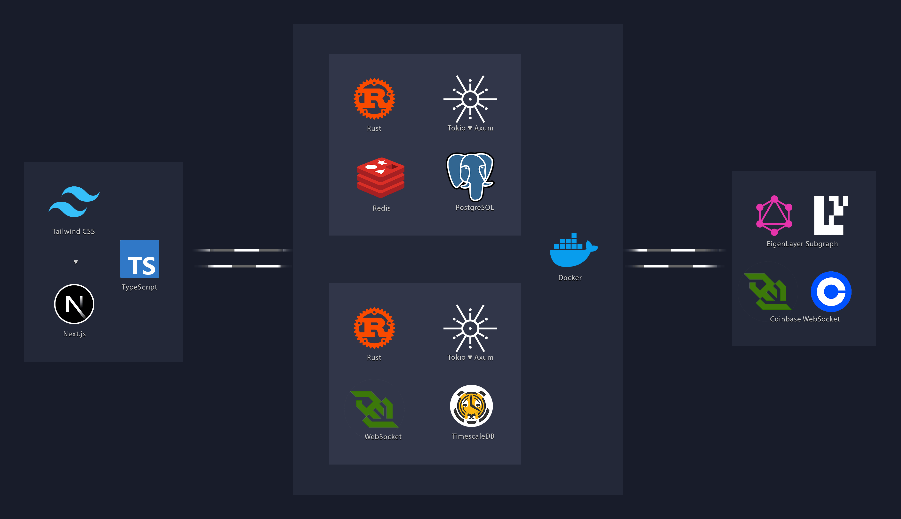

# Eigen Graph



This application is a data visualization dashboard for analyzing operator metrics within the EigenLayer Subgraph. It
features an interactive, token-centric interface where selecting a token dynamically updates all data views. Key
components include a detailed operator data table with filtering and sorting, a logarithmic bar chart for TVL
distribution, a donut chart showing AVS counts, and a Sankey diagram for operator-to-strategy weight allocation. All
components are synchronized through a global state reflected in the URL path.

---

> ### Sources of inspiration
> * [Blocks Signing and Streaming Service](https://github.com/0xdmtry/blocks-signer) — blocks signing service leveraging a event-driven solution
> * [Ethereum Blocks Service](https://github.com/0xdmtry/eth-block-api) — service for fetching and preserving Ethereum blocks
> * [Uniswap Graph](https://github.com/0xdmtry/eth-graph) — service to retrieve data on Uniswap v3 through The Graph
> 
> 

---

### Token Panel


The `TokenPanel` is a central UI component designed for the browsing, selection, and high-level overview of all
supported tokens. It serves as the primary entry point for users to interact with token-specific data.

**Key Features:**

* **Token Grid Display:** Renders a responsive grid of `TokenCard` components. Each card represents one of the 47
  supported tokens and displays key metrics, including its Total Value Locked (TVL) and the number of associated
  operators.
* **Collapsible Interface:** By default, the panel presents a condensed view showing two rows of tokens. A "Show
  More" / "Show Less" control allows for the smooth expansion and collapse of the grid, ensuring a clean and manageable
  layout.
* **Global State Integration:** The panel is connected to a global `TokenContext`. Each `TokenCard` is interactive;
  clicking a card updates the application's state by setting the selected token. This state change is immediately
  reflected in the URL path (e.g., `/EIGEN`), and the currently active `TokenCard` is visually highlighted.

#### Token Autocomplete


Embedded within the `TokenPanel` header, the `TokenAutocomplete` component offers a powerful and accessible way to find
and select tokens.

* **Dynamic Filtering:** Provides an input field that filters the list of 47 tokens in real-time. The search logic
  matches against both the token's symbol (e.g., `ALT`) and its full name (e.g., `AltLayer`).
* **Keyboard Navigation:** Full keyboard control is implemented for accessibility. Users can navigate the suggestion
  dropdown using `ArrowUp` and `ArrowDown` keys and make a selection using the `Enter` key.
* **Bidirectional State Synchronization:** The component is fully synchronized with the `TokenContext`. Selecting a
  token updates the URL. Conversely, navigating directly to a valid token URL (e.g., `/stETH`) will automatically
  populate the autocomplete input with the corresponding token's name.

#### Collapsible Interface


To maintain a clean and uncluttered user interface, the `TokenPanel` grid is collapsible. This functionality is designed
to manage vertical space, especially when a large number of tokens are displayed.

* **Initial State:** By default, the panel displays a preview limited to the first two rows of the token grid (a maximum
  of six `TokenCard` components).
* **Smooth Animation:** The transition between the collapsed and expanded states is animated. This is achieved using CSS
  transitions on the container's `max-height` property, ensuring a fluid user experience.
* **Toggle Control:** A full-width "Show More" button is present at the bottom of the grid to toggle the view. Upon
  expansion, the control's label changes to "Show Less," and its associated caret icon rotates 180 degrees to indicate
  the current state.
* **Conditional Rendering:** The toggle control is only rendered if the total number of tokens exceeds the number of
  cards visible in the collapsed state.

### Top Operators by TVL (Bar Chart)


The `OperatorTvlBarChart` component provides a bar chart visualization of the Total Value Locked (TVL) distribution
among the top-performing operators for the currently selected token.

* **Top Display:** The chart processes the incoming data to display the top operators, sorted in descending order
  by their TVL. Operators with zero TVL are automatically filtered out from the visualization.

* **Logarithmic Scale:** Due to the wide dynamic range of TVL values among operators, the chart's Y-axis employs a
  logarithmic scale. This scaling ensures that operators with vastly different TVL magnitudes are all clearly visible
  and comparable, emphasizing the ratio between their values rather than the absolute linear difference. A linear scale
  would render operators with smaller (yet significant) TVL amounts nearly invisible.

* **Custom Formatted Labels:** To maintain readability on the logarithmic axis, Y-axis labels are formatted in a "power
  of ten" notation (e.g., `1.23 × 10⁴⁰`). The number of visible labels is intentionally limited to avoid visual clutter,
  typically showing only major increments in magnitude.

* **Detailed Tooltip:** Hovering over any bar reveals a custom tooltip with precise data. The tooltip displays the
  operator's full, un-shortened ID and their exact TVL, also formatted in the "power of ten" style for detailed
  inspection.

### Operator Distribution by AVS Count (Donut Chart)


This component renders a donut chart to visualize the distribution of Actively Validated Services (AVSs) across
different operators for the selected token. The `avsCount` metric is used for this chart, as it provides a more
meaningful proportional comparison where values fall within a tighter range, unlike the wide variance in TVL.

* **Data Aggregation:** The chart displays the top six operators, sorted by their `avsCount` in descending order. To
  ensure readability, all remaining operators with a non-zero `avsCount` are aggregated into a single "Other Operators"
  slice.

* **Proportional Representation:** The size of each slice is directly proportional to the operator's `avsCount` as a
  share of the total AVSs from all operators represented in the chart.

* **Interactive Details on Hover:** Hovering over a slice triggers two data displays for immediate feedback:
    1. A dynamic label appears in the center of the donut, showing the operator's shortened ID and their specific
       `avsCount`.
    2. A standard tooltip provides the same information.

* **Legendless Design:** The chart is intentionally designed without a legend to maintain a clean and focused
  visualization, relying on the interactive hover effects for data exploration.

### Operators Data Table


The `OperatorsTable` component presents a comprehensive and interactive data grid of all operators associated with the
currently selected token.

* **Dynamic Content:** The table's data is directly tied to the global `TokenContext`. When a new token is selected (via
  the URL, Token Panel, or Autocomplete), the table automatically updates to display the corresponding set of operators.

* **Filtering by Operator ID:** A search input is located in the table's header, enabling case-insensitive filtering of
  the data based on the `operatorId`. Applying a filter resets the view to the first page of results.

* **Multi-Column Sorting:** Several columns, including TVL, AVSs, and Strategies, are sortable. Clicking a column header
  sorts the data by that attribute, defaulting to descending order on the first click. Subsequent clicks on the same
  header toggle between ascending and descending order. The active sort column and direction are indicated by
  highlighted arrow icons.

* **Pagination:** The table is paginated to handle large sets of data, displaying 10 operators per page. "Previous"
  and "Next" buttons facilitate navigation, and a status text indicates the current range of visible entries (e.g., "
  Showing 1 to 10 of 100").

* **Readability Formatting:** Data within the table is formatted for clarity. Operator IDs are shortened, TVL values are
  displayed in "power of ten" notation, and timestamps are converted to a human-readable date format (e.g.,
  `Sep 30, 2025`).

### Operator → Strategy Allocation (Sankey Chart)


A Sankey chart is a type of flow diagram used to depict the flow of quantities between different nodes. The width of
each link is proportional to its flow quantity, making this visualization ideal for representing resource allocation,
energy transfers, or financial distributions.

#### Rationale and Insights

This chart type is employed to illustrate the complex many-to-many relationship of weight distribution from operators to
various strategies. It provides a clear visual representation of the allocation network, offering insights that are not
easily discernible from tabular data alone.

* **Concentration Analysis:** Allows for the quick identification of concentration risk, such as a single strategy being
  heavily reliant on a small number of operators, or an operator focusing its entire weight on one strategy.
* **Operator Strategy Comparison:** Visually contrasts how different operators allocate their weight, highlighting
  patterns of diversification versus specialization.
* **Strategy Popularity:** Shows which strategies attract the most significant weight from the ecosystem's operators.

#### Implementation Details

The component is designed to be a self-contained module for analyzing allocation flows.

* **Data Normalization:** A key aspect of the implementation is that the weight of each link (the flow from an operator
  to a strategy) is normalized as a percentage of that specific operator's total delegated weight. This means the chart
  visualizes each operator's internal allocation choices rather than absolute system-wide TVL. To maintain clarity,
  flows that constitute less than 1% of an operator's total weight are filtered out from the view.
* **Interactive Filtering:** The component includes its own filtering mechanism, independent of the global token
  context. By default, it displays an aggregate view of allocations across all tokens. A series of token badges at the
  bottom allows for filtering the chart to show data for a single, specific token. Clicking an active badge deselects
  it, returning the chart to the default aggregate view.
* **Rendering:** The visualization is rendered using the `react-google-charts` library. Node labels for operators and
  strategies are shortened for a cleaner presentation.

### Commands

```bash
docker compose -f be.yml up --build
```

